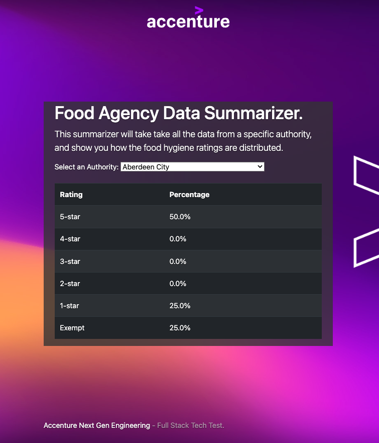

# Infinity Works - Full Stack Tech Test

## Prerequisites

* .NET Core SDK 3.1
* Access to the internet
* Suitable development environment

## Getting Started

* Restore packages: `dotnet restore`
* Build it: `dotnet build`
* Run it: `dotnet run --project ./InfinityWorks.TechTest/InfinityWorks.TechTest.csproj`
* View it: https://localhost:5001 and https://localhost:5001/api

## Submission

* Please do not fork this repository.
* Please do not commit your code to GitHub.
